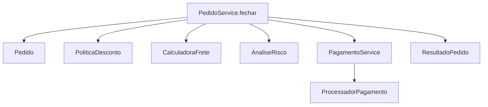
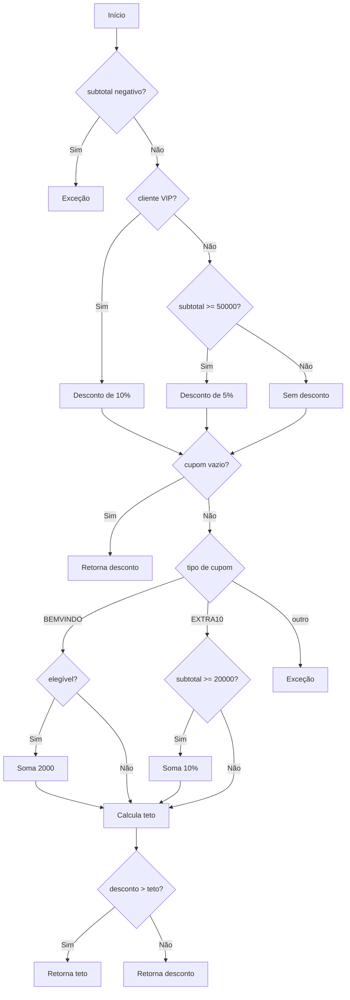
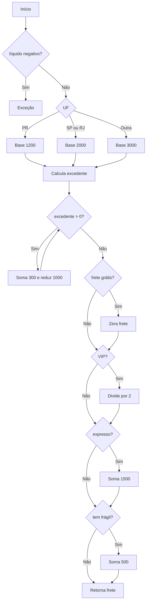
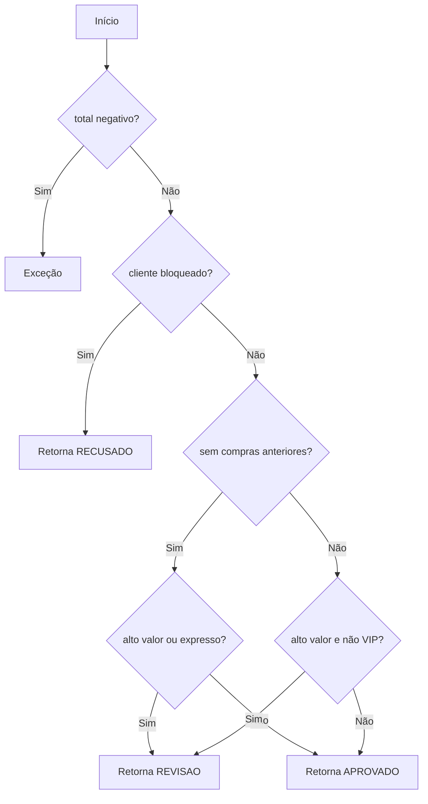
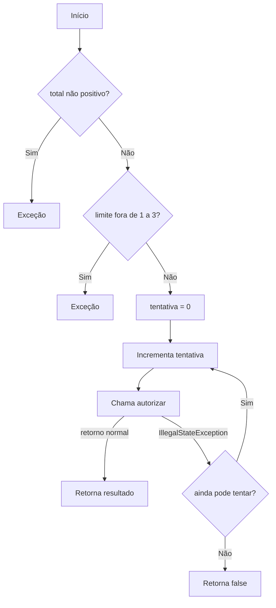
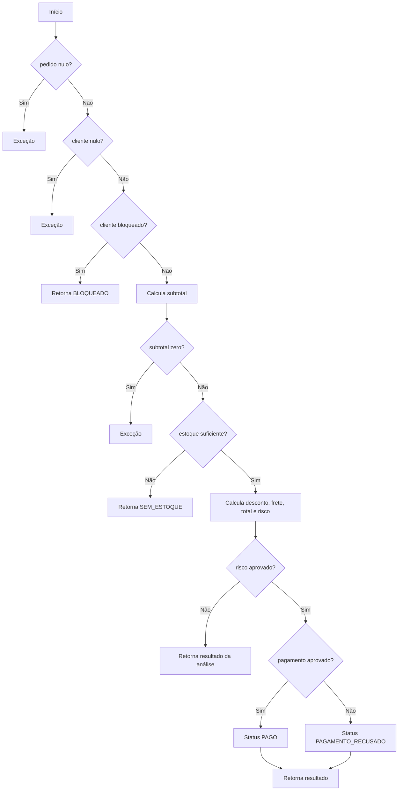

# Relatório do grupo

Integrante: André Augusto Silva Domingues

## Modelo usado nos grafos

Cada expressão booleana escrita em uma condição foi considerada uma decisão, inclusive quando possui `&&` ou `||`. O curto-circuito foi exercitado nos testes, mas seus operandos não foram separados em nós diferentes. Todos os retornos e exceções terminam em uma saída unificada. No `switch`, as três saídas acrescentam duas unidades à complexidade. No pagamento, a chamada externa possui uma saída normal e outra excepcional para o `catch`.

## Grafo de chamadas

## CFGs e complexidade

### `PoliticaDesconto.calcular`

### `CalculadoraFrete.calcular`

### `AnaliseRisco.avaliar`

### `PagamentoService.pagar`

### `PedidoService.fechar`

| Método | Nós | Arestas | V(G) | Base de caminhos | Restrições de viabilidade |
| --- | ---: | ---: | ---: | --- | --- |
| `PoliticaDesconto.calcular` | 21 | 29 | 10 | D1 a D10 | Cupons só são avaliados depois do desconto base; o teto depende do subtotal |
| `CalculadoraFrete.calcular` | 20 | 27 | 9 | F1 a F9 | Frete grátis exige entrega normal; expresso sempre soma a taxa |
| `AnaliseRisco.avaliar` | 12 | 16 | 6 | R1 a R6 | A regra de cliente novo e a regra com histórico são exclusivas |
| `PagamentoService.pagar` | 13 | 16 | 5 | P1 a P5 | Apenas `IllegalStateException` permite repetição |
| `PedidoService.fechar` | 20 | 26 | 8 | S1 a S8 | Bloqueio, subtotal zero e falta de estoque impedem as regras posteriores |

Em todos os casos, `V(G) = E - N + 2`. Para os métodos sem `switch` e sem a aresta excepcional do `catch`, o valor também corresponde ao número de decisões mais um.

## Bases de caminhos e entradas usadas

### Desconto — D1 a D10

1. Subtotal negativo, gerando exceção.
2. VIP sem cupom, aplicando 10%.
3. Cliente comum no limite de R$ 500,00, aplicando 5%.
4. Cliente comum abaixo do limite, sem desconto.
5. `BEMVINDO` elegível.
6. `BEMVINDO` sem elegibilidade por histórico ou subtotal.
7. `EXTRA10` elegível.
8. `EXTRA10` abaixo do limite.
9. Cupom desconhecido, gerando exceção.
10. VIP novo com `BEMVINDO`, ativando o teto de 20%.

### Frete — F1 a F9

1. Valor líquido negativo, gerando exceção.
2. Base do PR sem excedente.
3. Base de SP e RJ.
4. Tarifa padrão para outra UF.
5. Peso com uma e várias iterações no `while`.
6. Frete grátis no limite de R$ 300,00.
7. Cliente VIP pagando metade.
8. Entrega expressa somando R$ 15,00.
9. Item frágil somando R$ 5,00, inclusive quando a base foi zerada.

### Risco — R1 a R6

1. Total negativo.
2. Cliente bloqueado.
3. Cliente novo acima de R$ 1.000,00.
4. Cliente novo com entrega expressa.
5. Cliente com histórico, comum e acima de R$ 5.000,00.
6. Caminhos aprovados nos limites e para VIP.

### Pagamento — P1 a P5

1. Total ou quantidade de tentativas inválida.
2. Aprovação na primeira chamada.
3. Recusa definitiva, sem repetição.
4. Indisponibilidade seguida de sucesso.
5. Indisponibilidade até esgotar o limite e propagação de outra exceção.

### Fechamento — S1 a S8

1. Referência nula.
2. Cliente bloqueado.
3. Pedido sem itens ativos.
4. Falta de estoque.
5. Cupom inválido após estoque aprovado.
6. Análise em revisão sem pagamento.
7. Pagamento aprovado.
8. Pagamento recusado e indisponibilidade por três tentativas.

## Matriz de testes

| ID / método JUnit | Unidade | Entrada e estado do stub | Resultado esperado | Caminho / aresta | Critério atendido |
| --- | --- | --- | --- | --- | --- |
| `deveAplicarCupomBemVindoQuandoElegivel` | Desconto | Novo, R$ 100,00, `bemvindo` com espaços | R$ 20,00 | D5 | Normalização e limite |
| `deveLimitarDescontoAteVintePorCento` | Desconto | VIP novo e `BEMVINDO` | R$ 20,00 | D10 | Teto do desconto |
| `deveCobrarQuiloAdicionalOuFracao` | Frete | 2.001 g e 3.001 g | Uma e duas taxas | F5 | Uma/várias iterações |
| `deveDarFreteGratisNoLimiteParaEntregaNormal` | Frete | Líquido R$ 300,00 | Frete zero | F6 | Valor-limite |
| `deveMandarClienteNovoParaRevisaoPorEntregaExpressa` | Risco | Novo, baixo valor, expresso | `REVISAO` | R4 | Operando direito do `||` |
| `deveAprovarVipComHistoricoMesmoEmValorAlto` | Risco | VIP com histórico e valor alto | `APROVADO` | R6 | Curto-circuito e VIP |
| `deveRepetirAposIndisponibilidadeEConcluir` | Pagamento | Primeira chamada lança exceção; segunda aprova | `true`, duas chamadas | P4 | `catch` e repetição |
| `deveRetornarFalsoDepoisDeEsgotarTentativas` | Pagamento | Stub sempre indisponível | `false`, três chamadas | P5 | Saída do laço |
| `deveIdentificarFaltaDeEstoqueNoInicioENoFim` | Pedido | Item indisponível em posições diferentes | `false` | Laço e `break` | Zero/uma/várias linhas |
| `devePararAntesDosItensQuandoClienteEstaBloqueado` | Serviço | Pedido vazio e cupom inválido; stub conta chamadas | `BLOQUEADO`, zero chamadas | S2 | Retorno antecipado |
| `deveRetornarRevisaoSemTentarPagamento` | Serviço | Cliente novo, expresso; stub conta chamadas | `REVISAO`, zero chamadas | S6 | Colaboração sem cobrança |
| `deveTentarPagamentoTresVezesQuandoProcessadorEstaIndisponivel` | Serviço | Stub sempre lança `IllegalStateException` | `PAGAMENTO_RECUSADO`, três chamadas | S8 | Colaboração e tentativas |

## Evolução da cobertura

| Etapa | Testes executados | Linhas | Branches | Métodos | Classes | Lacunas e justificativas |
| --- | ---: | ---: | ---: | ---: | ---: | --- |
| Inicial | 1 | Não medido | Não medido | Não medido | Não medido | Somente o exemplo de fechamento |
| Suítes por classe | 53 | 100% | 100% | 100% | 100% | Nenhuma lacuna alcançável |
| Suíte final com colaboração | 62 | 100% | 100% | 100% | 100% | 9 de 9 classes concretas executadas |

O relatório foi gerado com `mvn clean test` e fica em `target/site/jacoco/index.html`. A pasta `target` não é enviada ao GitHub porque é gerada novamente pelo Maven.

## Análise crítica

- Cobrir os ramos de `Participacao` ou do cálculo de frete não comprova todas as combinações possíveis. Decisões independentes podem formar combinações diferentes mesmo quando cada saída verdadeira e falsa já apareceu ao menos uma vez.
- Em `total > 100_000 || expresso`, o segundo operando não é avaliado quando o total já é alto. Em `total > 500_000 && !cliente.vip()`, o VIP só é consultado quando o valor ultrapassa o limite.
- `AnaliseRisco` permite testar diretamente um cliente bloqueado e obter `RECUSADO`. Pelo `PedidoService`, esse caminho não chega ao componente de risco porque o serviço retorna `BLOQUEADO` antes.
- As exceções foram verificadas com `assertThrows`. O `while` do frete foi testado com zero, uma e várias iterações, e o `do/while` do pagamento com uma, duas e três chamadas.
- Como teste de mutação, a regra de VIP foi alterada temporariamente de 10% para 9%. O teste `deveDarDezPorCentoParaVip` falhou, obtendo 900 em vez de 1000. A regra original foi restaurada antes da execução final.
- O JaCoCo não conta o tratamento de exceção como branch. Mesmo assim, os caminhos do `catch`, as exceções de validação e a propagação de uma exceção definitiva foram testados explicitamente.
