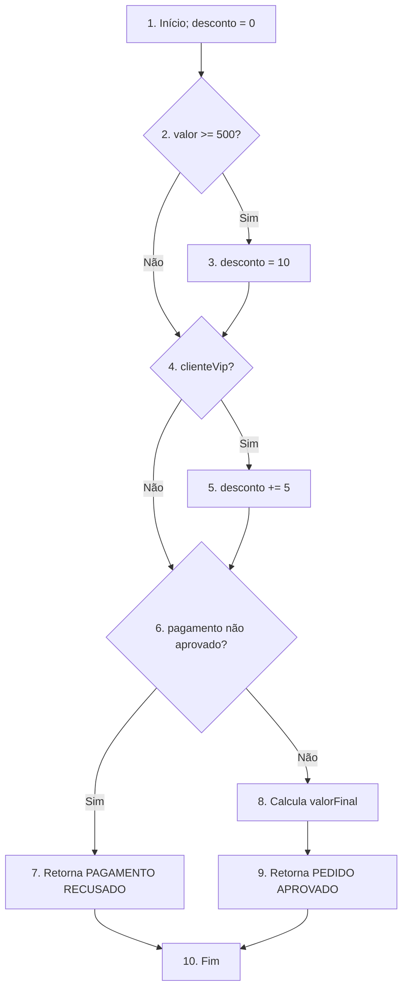
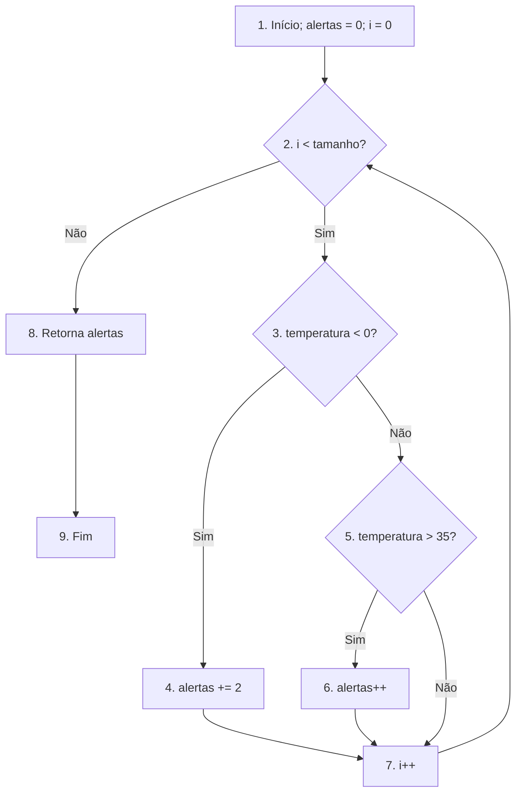

# Exercícios — Grafo de Fluxo de Controle

Aluno: André Augusto Silva Domingues

## Exercício 1 — Classificação de pedido

### Blocos básicos e decisões

| Nó | Conteúdo |
| --- | --- |
| 1 | Início e `desconto = 0` |
| 2 | Decisão `valor >= 500` |
| 3 | `desconto = 10` |
| 4 | Decisão `clienteVip` |
| 5 | `desconto += 5` |
| 6 | Decisão `!pagamentoAprovado` |
| 7 | Retorno `PAGAMENTO RECUSADO` |
| 8 | Cálculo de `valorFinal` |
| 9 | Retorno `PEDIDO APROVADO` |
| 10 | Fim |

As decisões estão nos nós 2, 4 e 6.

### Arestas e complexidade

As arestas são: 1→2, 2→3, 2→4, 3→4, 4→5, 4→6, 5→6, 6→7, 6→8, 7→10, 8→9 e 9→10.

- Número de nós: `N = 10`
- Número de arestas: `E = 12`
- `V(G) = E - N + 2 = 12 - 10 + 2 = 4`
- `V(G) = decisões + 1 = 3 + 1 = 4`

### Base de caminhos e casos de teste

| Caminho | Sequência de nós | valor | clienteVip | pagamentoAprovado | Resultado esperado |
| --- | --- | ---: | --- | --- | --- |
| P1 | 1-2F-4F-6F-8-9-10 | 100 | false | true | `PEDIDO APROVADO: 100.0` |
| P2 | 1-2V-3-4F-6F-8-9-10 | 500 | false | true | `PEDIDO APROVADO: 450.0` |
| P3 | 1-2F-4V-5-6F-8-9-10 | 100 | true | true | `PEDIDO APROVADO: 95.0` |
| P4 | 1-2F-4F-6V-7-10 | 100 | false | false | `PAGAMENTO RECUSADO` |

### Questões para discussão

- Existem `2³ = 8` combinações possíveis entre as três condições booleanas consideradas.
- O número de combinações não é igual à complexidade ciclomática. As oito combinações representam todas as combinações de resultados das condições, enquanto a complexidade 4 representa a quantidade de caminhos independentes necessária para formar uma base.
- O `return` dentro da terceira condição cria uma saída antecipada que vai direto ao fim do método.
- Quando o pagamento não foi aprovado, o cálculo de `valorFinal` não é executado.

## Exercício 2 — Análise de leituras de temperatura

### Blocos básicos e decisões

| Nó | Conteúdo |
| --- | --- |
| 1 | Início, `alertas = 0` e `i = 0` |
| 2 | Decisão `i < temperaturas.length` |
| 3 | Decisão `temperaturas[i] < 0` |
| 4 | `alertas += 2` |
| 5 | Decisão `temperaturas[i] > 35` |
| 6 | `alertas++` |
| 7 | `i++` |
| 8 | Retorno de `alertas` |
| 9 | Fim |

As decisões estão nos nós 2, 3 e 5.

### Arestas e complexidade

As arestas são: 1→2, 2→3, 2→8, 3→4, 3→5, 4→7, 5→6, 5→7, 6→7, 7→2 e 8→9.

- Número de nós: `N = 9`
- Número de arestas: `E = 11`
- `V(G) = E - N + 2 = 11 - 9 + 2 = 4`
- `V(G) = decisões + 1 = 3 + 1 = 4`

### Base de caminhos e casos de teste

| Caminho | Sequência de nós | Vetor | Retorno esperado |
| --- | --- | --- | ---: |
| P1 | 1-2F-8-9 | `[]` | 0 |
| P2 | 1-2V-3V-4-7-2F-8-9 | `[-1]` | 2 |
| P3 | 1-2V-3F-5V-6-7-2F-8-9 | `[36]` | 1 |
| P4 | 1-2V-3F-5F-7-2F-8-9 | `[20]` | 0 |

Também é importante testar os limites: `[0]` retorna 0 e `[35]` retorna 0.

### Questões para discussão

- Um vetor com várias temperaturas pode repetir partes do grafo, pois cada item causa uma nova iteração.
- O vetor vazio permite sair do método sem acessar nenhuma posição.
- Os valores 0 e 35 verificam os limites inclusivos do intervalo que não gera alerta.
- O `else if` precisa aparecer como outra decisão porque também possui duas saídas possíveis.
- A aresta 7→2 representa o retorno do laço. Sem ela, o grafo mostraria somente uma execução e não representaria o comportamento real do `while`.
